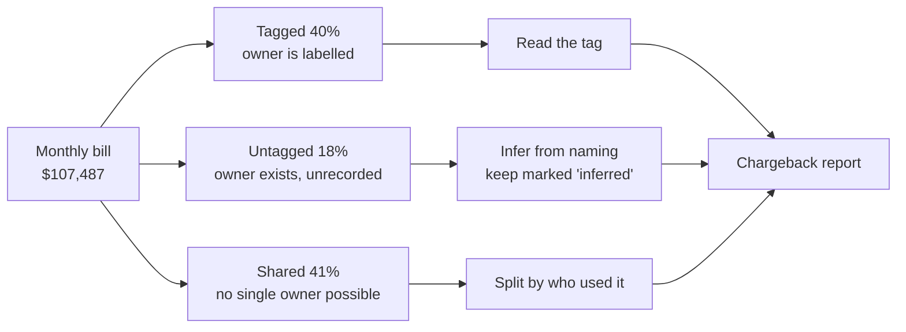
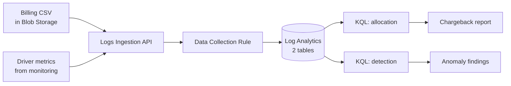

# Cloud Cost Allocation & Anomaly Detection

## The problem, plainly

A company gets a $9,000 cloud bill each month. The bill says what was
bought — servers, storage, databases. It doesn't say **who bought it**.

So when the CFO asks why Merchandising's spend went up, nobody can answer.
The bill has no idea Merchandising exists. Cloud providers bill by resource;
businesses budget by team; nothing connects the two.

That gap is what this project closes — and once every dollar has an owner,
the same data starts revealing what the bill was quietly hiding.

## The approach, plainly

Every dollar falls into one of three piles:

**Tagged** is easy — someone labelled it. **Untagged** has a real owner who
never wrote it down; you work it out from naming conventions and stay honest
that it's a guess. **Shared** is one firewall and one cluster used by three
teams, where no label could ever be correct. That last pile has to be divided
up, and how you divide it is a judgment call worth thousands of dollars.

To divide it fairly you need to know who actually used what. The bill can't
tell you — it says the cluster cost $1,100 and stops. That lives in a
different system: monitoring. So a second dataset supplies compute-hours,
log volume, and network traffic per team, and the shared bill gets split in
those proportions.

> Data is **synthetic** — 10,579 rows, 27 resources, 12 months, matching the
> schema of a real Azure Cost Management export. Generator in `/data`.
> Everything here would run unchanged against real billing data.

---

## Pipeline

The CSV lands in blob storage — exactly where a real scheduled Cost
Management export would drop it — then gets pushed through Azure's Logs
Ingestion API into a queryable table.

## Allocation methodology

Each shared resource is split by the driver that actually explains its cost:

| Shared resource | Driver |
|---|---|
| AKS cluster | vCPU-hours |
| Log Analytics workspace | ingestion GB |
| Bandwidth, firewall data-processed | egress GB |
| Firewall deployment, VPN gateway, ACR | headcount |

The firewall splits across two drivers by meter — data processed is
usage-driven, the fixed hourly charge isn't.

**Picking the driver moved $3,552 between teams.** Allocating everything by
cluster usage — the obvious shortcut — understated Corporate by 67%. Both
versions are in `/queries` (`03` naive, `04` correct); the gap between them
is the finding.

## Result

| Cost center | Direct | Allocated | Total | Share |
|---|---|---|---|---|
| Storefront | $31,477.33 | $22,428.09 | $53,905.42 | 50.2% |
| Merchandising | $28,593.87 | $14,161.49 | $42,755.36 | 39.8% |
| Corporate | $2,924.92 | $7,902.20 | $10,827.12 | 10.1% |

No unallocated remainder. **73% of Corporate's cost is shared infrastructure
it doesn't own** — a tags-only view showed that team as nearly free.

## Detection

Four detectors, because no single technique finds more than a quarter of
the problems:

| Shape | Method | Catches |
|---|---|---|
| Step change | week-over-week % | resize-and-forget, incidents |
| Slow creep | linear regression, R² > 0.7 | missing lifecycle policies |
| Flat | coefficient of variation < 0.05 | orphaned disks, IPs, snapshots |
| From zero | first-billing-day | new service adoption |

All nine planted anomalies found. Precision, stated honestly:

- **Step-change:** 4 alerts — 2 real, 1 duplicate, 1 false positive (holiday
  freeze ending). 50%. A higher threshold reaches 100% but goes blind to
  anything growing slowly.
- **Orphan:** 14 rows, 3 real. 21%, and unfixable statistically — an
  abandoned disk and a healthy VM bill identically. That signal isn't in
  cost data; it's in the resource graph.

A threshold alert on total spend would have caught none of the creep cases
and none of the orphans.

## Repo

- `/queries` — 10 KQL files, numbered in the order the analysis ran
- `/data` — synthetic data generator, seeded and reproducible
- `/docs` — architecture notes, planted-event key
